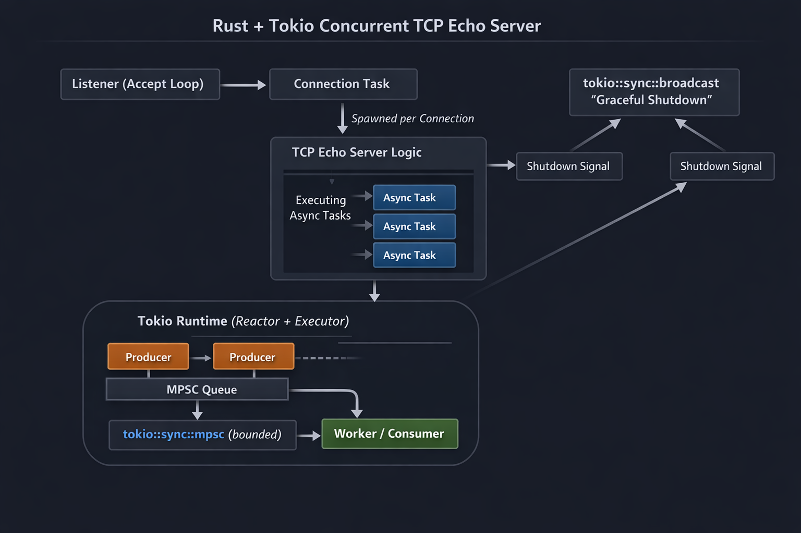

# tokio-lab — TCP Echo Server & Producer–Consumer (Rust + Tokio)

`tokio-lab` è un mini progetto didattico in Rust che implementa un TCP echo
server concorrente e un pattern Producer–Consumer usando Tokio.

Lo scopo principale del progetto è **didattico**: esplorare in modo pratico
runtime async, task spawning, ownership cross-task, bounded vs unbounded channel,
e testing asincrono attraverso un dominio reale (networking + concorrenza),
evitando strutture artificiali.

## Stato del progetto

Questo repository è sviluppato incrementalmente.

**STEP 1 in corso:**

- scaffolding progetto, `Cargo.toml` con dipendenze minime
- TCP echo server single-client con `TcpListener` + `TcpStream`

## Requisiti

- Rust stable ≥ 1.75 (edizione 2021)
- Tokio 1.43 con feature `full`
- Dipendenze: `tokio`, `tracing`, `tracing-subscriber`
- CLI senza framework esterni

## Roadmap

- [x] STEP 1 — scaffolding + echo server single-client
- [ ] STEP 2 — concorrenza multi-client (`tokio::spawn`, `Send + 'static`)
- [ ] STEP 3 — graceful shutdown (`tokio::select!`, `tokio::signal::ctrl_c`)
- [ ] STEP 4 — logging strutturato (`tracing` + `tracing-subscriber`)
- [ ] STEP 5 — Producer–Consumer bounded (`tokio::sync::mpsc`, backpressure)
- [ ] STEP 6 — variante broadcast multi-consumer (`tokio::sync::broadcast`)
- [ ] STEP 7 — gestione errori robusta e client disconnect
- [ ] STEP 8 — unit test asincroni (`#[tokio::test]`)
- [ ] STEP 9 — test d'integrazione (server in background + echo + timeout)
- [ ] STEP 10 — script demo e checklist di verifica
- [ ] STEP 11 — refactoring + documentazione concetti async

## License

Licensed under [MIT license](LICENSE).
